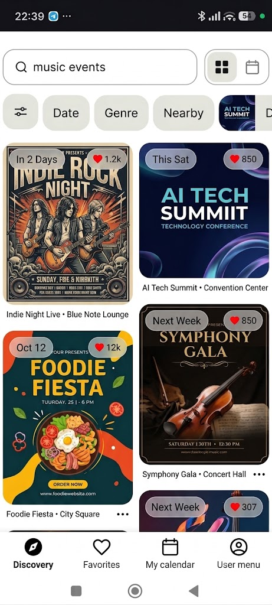

# FestDaily

**Discover, save, and never miss the local events you'd actually want to go to.**

FestDaily helps city residents and families cut through disorganized event info — scattered across social media, easy to forget, hard to search — and turns it into a searchable, filterable, personal event calendar.

> **Naming note:** this repository and its packages are still named `festgrid` (its original working name). The product itself was renamed **FestDaily** partway through development; all docs below use the current name.

[](#project-status--roadmap)
[](LICENSE)


---

## Screenshot



*Discovery feed (mobile): search, category filters, and card/calendar view toggle.*

---

## Why this repo is worth a look

This isn't just a CRUD app — it's a fully **spec-driven, AI-assisted build**: every feature traces back to a PRD line item, an architectural decision, and a story file, all committed to the repo (see [Planning & Process Artifacts](#planning--process-artifacts)). A few problems that came up along the way, and how they were solved:

- **Query sprawl across features.** Discovery feed, favorites, calendar, and per-account public pages all needed "a list of events, filtered." Rather than grow a bespoke endpoint per view, every client query — regardless of feature — compiles down to one recursive JSON **Unified Query DSL** served by a single event-query endpoint. New views become new query conditions, not new endpoints. ([architecture spine, AD-1/AD-2](_bmad-output/planning-artifacts/festgrid-architecture-spine.md))

- **Trusting the wrong boundary.** External input (scraped social posts, AI-extracted event data) and internal client input are different threat models, so they get different validators: **AJV/JSON Schema** guards the backend edge, **Zod** guards the frontend edge, and the two libraries are never mixed inside a shared package — a rule enforced structurally, not just by convention.

- **Silent data resurrection.** A naive soft-delete makes it easy for one resolver to forget the `deletedAt` filter and leak a user-hidden or moderator-reverted row back into a list. Instead, the **exclusion is enforced once**, in the shared query-building layer that every event/favorite/calendar/subscription read goes through — backed by Postgres partial indexes on the active-row subset, so the common case stays fast. ([AD-8](_bmad-output/planning-artifacts/festgrid-architecture-spine.md))

- **Finding the bottleneck before it blocks anyone.** Before implementation reached Epic 2, all six epics' readiness reports were synthesized into a ranked [critical-path report](_bmad-output/planning-artifacts/critical-path-report-2026-07-31.md) — surfacing, for example, that the GraphQL auth-context layer (Story 0.17) alone gates four downstream epics. That story got prioritized ahead of schedule instead of being discovered as a blocker mid-sprint.

- **Compute-cost-aware AI workflow.** Not every task needs the same model. Development uses **semantic task-based routing**: broad contextual analysis and user-story framing are delegated to an advanced reasoning LLM, while routine code generation is funneled to a lightweight, instruction-tuned codegen model — optimizing compute expenditure without sacrificing spec accuracy.

- **Velocity without cutting corners.** Time is treated as a resource to budget deliberately, not just spend: the [critical-path report](_bmad-output/planning-artifacts/critical-path-report-2026-07-31.md) above sequences *what* gets built first, and two structural choices control *how fast* each piece can be built and verified without quietly eroding quality — a **tiered testing strategy** (100% unit-test coverage is mandatory only in `packages/domain`, the pure business-logic layer; everything else follows a "testing trophy" of integration-first tests plus E2E coverage for critical flows only, so test effort scales with actual risk instead of blanket coverage targets) and **shared, cached TypeScript builds** (every package/app extends one base `tsconfig`, and Turbo caches and parallelizes `build`/`lint`/`test` per package so a change in one workspace doesn't force a full monorepo recompile).

---

## Features

- **Event Discovery** — curated listings with free-text search (event name, performer, location) and type/category filters; discovery pages default to ongoing/upcoming events only.
- **Personalization** — favorite events, a dedicated favorites page, and a dedicated "added to calendar" page.
- **Saved Locations** — save multiple named locations (current-location or map-picked) and find nearby events within a configurable radius.
- **Event Management** — one-way calendar export (per schedule), centralized event detail with source-post/account attribution.
- **Calendar View** — visually distinguishes favorited vs. added events, with independent show/hide toggles.
- **Social Media Account Subscription (BYOK)** — subscribe to social accounts; a Gemini-powered AI agent extracts event details from posts, using a fairness-aware, round-robin quota algorithm across contributing users' API keys.
- **Manual Post Selection** — choose exactly which posts get processed, with live quota tracking, instead of blindly extracting everything.
- **Manual Correction & Moderation** — typed-input correction forms with consistency checks, plus a user-reporting flow (cancelled / dangerous / personal) and a moderator queue.
- **Onboarding Wizard** — guided setup for API key + subscriptions + first post selection.
- **Global UX patterns** — infinite scroll everywhere long lists appear, context-aware "next/previous" detail navigation that respects the originating list's filters, and blocking vs. skeleton loading states used consistently.

Full functional spec: [PRD](_bmad-output/planning-artifacts/prds/festgrid-prd-2026-07-10-2047/prd.md).

---

## Architecture at a Glance

FestDaily is a `pnpm` + `turbo` monorepo:

```
apps/
  web/        Next.js 15 / React 19 frontend
  backend/    AWS serverless backend (API Gateway, Lambda, SQS, EventBridge)
packages/
  ui/                 shared component library (Shadcn/ui + Radix + Tailwind)
  database/           Drizzle ORM schema & migrations (Supabase/Postgres)
  shared-types/       cross-app TypeScript types
  analytics/          shared PostHog instrumentation helpers
  eslint-config/, typescript-config/
```

Eight binding architectural decisions govern consistency across the codebase — unified query DSL, unified event querying, code-first schema migrations, strict three-tier frontend state (server/URL/client), single-provider analytics instrumentation, single-framework i18n, JWT-verified auth context, and the soft-delete convention. Full rationale for each: [Architecture Spine](_bmad-output/planning-artifacts/festgrid-architecture-spine.md).

Infrastructure deep-dive by layer: [`docs/infrastructure/`](docs/infrastructure/index.md).

### Tech Stack

| Layer | Technology |
|---|---|
| Language | TypeScript (strict mode) |
| Frontend | Next.js 15, React 19, Shadcn/ui (Radix + Tailwind) |
| Frontend state | TanStack Query (server), `nuqs` (URL), Zustand (ephemeral client) |
| Backend | AWS API Gateway, Lambda, SQS, EventBridge (serverless) |
| API | GraphQL (code-generated client types) |
| Database | Supabase (Postgres) + Drizzle ORM |
| Auth | Supabase Auth (JWT/JWKS-verified) |
| AI extraction | Gemini API via a rate-limited AI Gateway adapter (BYOK) |
| Analytics | PostHog |
| Push notifications | Firebase Cloud Messaging |
| Geolocation | Geoapify |
| i18n | next-intl (`en`, `id`) |
| Validation | AJV (backend boundary), Zod (frontend boundary) |
| Testing | Vitest, MSW, Playwright |
| CI/CD | GitHub Actions |

---

## Getting Started

```bash
pnpm install
pnpm dev     # turbo run dev, all apps
pnpm test    # turbo run test
pnpm lint    # turbo run lint
pnpm build   # turbo run build
```

Full environment setup (Vercel, AWS, Supabase, FCM, PostHog, Geoapify credentials): see **[SETUP_WALKTHROUGH.md](SETUP_WALKTHROUGH.md)**.

---

## Project Status & Roadmap

FestDaily is **actively in development** and built incrementally, epic by epic, with each story reviewed before merge.

| Epic | Scope | Status |
|---|---|---|
| 0 | Project setup & DevOps foundation | In progress (mostly done/in review) |
| 1 | Core app & event discovery | In progress (mostly done/in review) |
| 2 | Personalization (favorites, saved locations, calendar) | In progress |
| 3 | Social media subscription & AI extraction | Backlog |
| 4 | Data quality, correction & moderation | Backlog |
| 5 | Capacity, quota & scaling | Backlog |

Live, per-story detail: [`sprint-status.yaml`](_bmad-output/implementation-artifacts/sprint-status.yaml).

---

## Planning & Process Artifacts

Every decision behind this codebase is written down, not just implied by the code:

| Artifact | What it covers |
|---|---|
| [PRD](_bmad-output/planning-artifacts/prds/festgrid-prd-2026-07-10-2047/prd.md) | Full product requirements & data schema |
| [Architecture Spine](_bmad-output/planning-artifacts/festgrid-architecture-spine.md) | The 8 binding architectural decisions (AD-1–AD-8) |
| [Epics & Stories](_bmad-output/planning-artifacts/epics.md) | Full epic/story breakdown with acceptance criteria |
| [Critical-Path Report](_bmad-output/planning-artifacts/critical-path-report-2026-07-31.md) | Cross-epic dependency analysis — which stories are true bottlenecks vs. local prerequisites |
| [Epic Readiness Reports](_bmad-output/planning-artifacts/epic-readiness/) | Per-epic architecture & foundational-dependency sweeps |
| [Sprint Status](_bmad-output/implementation-artifacts/sprint-status.yaml) | Live status of every story |
| [Infrastructure Docs](docs/infrastructure/index.md) | Per-layer infrastructure design |
| [UX Design Artifacts](design-artifacts/) | Trigger map, scenarios, design system, visual specs |

---

## Built With BMad

This project is built end-to-end using the [BMad Method](https://docs.bmad-method.org) — a spec-driven, agentic development workflow that carries a feature from PRD through architecture, epics/stories, implementation, and code review, with every stage's output committed to the repo. Curious how that workflow actually runs, or want to pick up a story yourself? See **[CONTRIBUTING.md](CONTRIBUTING.md)**.

---

## Contributing

See **[CONTRIBUTING.md](CONTRIBUTING.md)** for the BMad workflow walkthrough, repo conventions, and how to pick up a story.

## License

[MIT](LICENSE)
