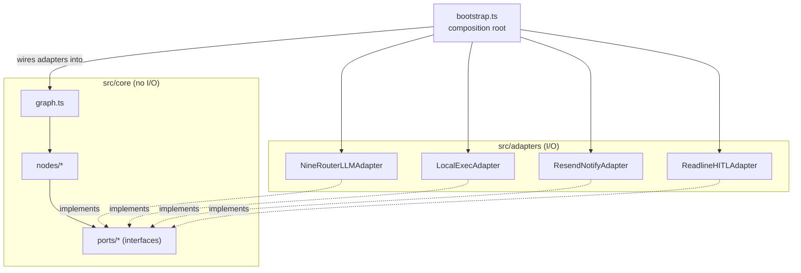

# Architecture Spine — AI Dev Orchestrator

## Design Paradigm

**Hexagonal / Ports & Adapters.** The LangGraph state machine and node decision logic form the core; every side effect (LLM calls, filesystem/shell/git exec, email, terminal I/O) crosses a port interface the core defines but never implements. Concrete adapters implement those ports and are wired in by a single composition root at startup — so the graph logic runs identically against real infrastructure or fakes.

- Core → `src/core/` (graph wiring, node decision logic, entity types, port interfaces)
- Adapters → `src/adapters/` (real implementations + `fakes/` test doubles)
- Composition root → `src/bootstrap.ts`
- Dependency wiring → a single `NodeContext` (`core/node-context.ts`: the four ports, resolved target-project paths, run-scoped audit logger, config) assembled once by `bootstrap.ts` and closed over by each node's factory function (`createPlannerNode(ctx) => (state) => ...`) — no node reaches for a port, path, or the logger any other way (found missing during the Epic 0 readiness sweep; `GraphState` stays exactly six fields, this is graph-construction-time wiring, never part of the state that flows through the graph)

## Invariants & Rules

### AD-1 — Ports & Adapters boundary, with fixed port contracts

- **Binds:** all
- **Prevents:** a node importing `fs`/`child_process`/`fetch`/a 9Router client directly, bypassing its port and breaking testability/sandboxing; two independent implementers filling in a port's method signature differently
- **Rule:** `src/core/**` may depend only on the port interfaces in `src/core/ports/` (`LLMPort`, `ExecPort`, `NotifyPort`, `HITLPort`). Every side effect — including git operations — goes through one of these ports. Concrete adapters live under `src/adapters/`; tests exercise core against `src/adapters/fakes/`, never real adapters. Signatures are fixed, not just names:
  - `LLMPort.complete({ role: NodeRole; systemPrompt: string; messages: Message[] }): Promise<string>` — `role` is passed per call; the adapter resolves `role` to a model alias internally (AD-6). No adapter instance is pre-bound to one model.
  - `ExecPort.run({ cmd: string; args: string[]; cwd?: string }): Promise<{ stdout: string; stderr: string; exitCode: number }>` — `args` is always an argv array, never an interpolated shell string, so LLM-generated command text can never reach a shell as raw input. Both `cwd` and any resolved file-path argument are boundary-checked against `TARGET_REPO_PATH`; escape attempts are rejected before spawning. A bounded timeout kills a hung process rather than blocking indefinitely.
  - `ExecPort.readFile(path): Promise<{ content: string; fingerprint: string }>` and `ExecPort.writeIfUnchanged(path, content, fingerprint): Promise<void>` — file content I/O via `node:fs` directly, never shelled through `run()`. `writeIfUnchanged` re-checks the fingerprint immediately before writing and throws rather than overwriting a file that changed since it was read (external-mutation protection).
  - `ExecPort.getWrittenPaths(): string[]` / `ExecPort.resetWrittenPaths(): void` — every successful write is tracked; `GitCheckpoint` (AD-4) stages only these paths, never the whole tree.
  - `NotifyPort.send({ to: string; subject: string; body: string }): Promise<void>`
  - `HITLPort.prompt({ summary: string; expand: () => string }): Promise<string>` — resolves with the human's free-form response.
  - The HITL timeout race (readline wait vs. `HITL_TIMEOUT_MS`) is owned by the HITL node in **core**, not by any adapter: the node calls `HITLPort.prompt()` and races it against its own timer, calling `NotifyPort.send()` itself if the timer wins. Adapters only ever perform their one I/O action; they never orchestrate a race or a retry.
  - Every port throws a typed `OrchestratorError { message: string; recoverable: boolean; cause: unknown }` on failure. The calling node — never the adapter — decides what happens next: retry within the existing AUTO_FIX budget (AD-3) if `recoverable`, otherwise route straight to HITL.

### AD-2 — Reviewer verdict is the sole state-transition signal, across two tiers

- **Binds:** CAP-2, CAP-6, CAP-7, CAP-13
- **Prevents:** ad hoc pass/fail booleans or free-form strings driving graph edges; two verdict producers disagreeing on when the second one is even allowed to run
- **Rule:** `ReviewVerdict = 'APPROVE' | 'AUTO_FIX' | 'NEEDS_HUMAN'` (`src/core/types.ts`) is the only value any reviewing node may return, and the only value graph edges branch on. Two nodes produce it: the Tier-1 Complex Worker/Reviewer (every implementation attempt) and the Tier-2 `DeepCodeReviewNode` (CAP-13). Tier-2 runs **only** when Tier-1 returns `APPROVE`, and may downgrade that verdict to `AUTO_FIX` or `NEEDS_HUMAN`; Tier-2 never runs on a Tier-1 `AUTO_FIX` or `NEEDS_HUMAN`.

### AD-3 — AUTO_FIX retry ceiling is part of the rubric, shared across both tiers, increments on every applied patch

- **Binds:** CAP-2, CAP-6, CAP-7, CAP-13
- **Prevents:** an unbounded AUTO_FIX loop burning tokens on a story that is genuinely stuck; two implementers disagreeing on the increment condition, how many real attempts `MAX_AUTO_FIX_ATTEMPTS = 1` actually allows, or whether Tier-2 downgrades get their own separate budget
- **Rule:** the ceiling is one of the rubric's own `NEEDS_HUMAN` triggers (matches `state-machines.md`), not a separate override layer on top of it. `story.autoFixAttempts` increments on **every applied AUTO_FIX patch**, tier-agnostic, **regardless of whether the following Tester run passes or fails** — not only on a post-patch failure (a patch that makes Tester pass but still leaves the reviewing tier unsatisfied is still a real attempt; gating the increment on Tester failing specifically would let a story cycle indefinitely as long as each round's Tester run happened to pass). This is the single authoritative statement of the rule — `state-machines.md` states it identically; the two must never diverge. Both the Tier-1 Reviewer and Tier-2 `DeepCodeReviewNode` check `autoFixAttempts >= MAX_AUTO_FIX_ATTEMPTS` (env, default 1) as their first step on every call and short-circuit straight to `NEEDS_HUMAN` with no further LLM call once at ceiling. There is exactly one counter per story, not one per tier. **Accepted tradeoff:** because the budget is shared, a single successful Tier-1 fix can consume it entirely before Tier-2 ever gets a turn of its own — intentional, fail-fast by default; the env var is there to raise it.

### AD-4 — Checkpoint commit fires only once BOTH review tiers APPROVE, stages only tracked writes

- **Binds:** CAP-6, CAP-11, CAP-13
- **Prevents:** noisy commits from AUTO_FIX churn; any automatic push/force-push; committing after Tier-1 alone and silently bypassing Tier-2 review (CAP-13's entire purpose); a human editing unrelated files elsewhere in `TARGET_REPO_PATH` at any point during a long multi-story run getting silently folded into an autonomous commit
- **Rule:** a dirty-tree pre-flight gate (part of `bootstrap.ts`'s startup sequence, not a graph node) runs `git status --porcelain` against `TARGET_REPO_PATH` at run start and **refuses to start** (hard error) on any pre-existing uncommitted or untracked change. Given a clean start, the GitCheckpoint node runs only after **both** the Tier-1 Reviewer and the Tier-2 Deep Code Review (AD-2) return `APPROVE` for the same story — never on a Tier-1 `APPROVE` alone. It calls `ExecPort.getWrittenPaths()` — the set of paths `ExecPort.writeFile`/`writeIfUnchanged` actually wrote since the last reset — and issues `git add <those paths>`, **never `git add -A`**, then `git commit` (message references the `epics.md` dotted key, e.g. `1.3a` — not the `sprint-status.yaml` slug key, which is a different format) through `ExecPort` — never `git push`. Staging only tracked writes, not the whole tree, removes the "nothing else changes during the run" assumption entirely: the dirty-tree gate only needs to hold at run start, not for the run's full duration, since anything a human edits mid-run that the orchestrator didn't itself write is structurally excluded regardless of timing. `ExecPort.resetWrittenPaths()` runs immediately after each successful commit so the next story starts tracking from empty. The commit includes the story's code changes, its updated story file (task checkboxes, Tier-1/Tier-2 review findings appended), and its `sprint-status.yaml` entry (flipped to `done`) together. Exactly one commit per completed story, whether reached via the autonomous loop or a manual-review AUTO_FIX (CAP-6).

### AD-5 — Real BMad artifacts are the canonical state; SQLite is ephemeral run-state only, with per-artifact write ownership

- **Binds:** all nodes
- **Prevents:** a node inventing its own side-channel state that drifts from the real files a human (or the real `bmad-*` skills) would also read; two nodes writing the same file range for the same reason; a crash mid-epic silently losing progress; an orchestrator-invented status value leaking into `sprint-status.yaml` and breaking other BMad tooling
- **Rule:** `epics.md`, each story's `.md` file, `sprint-status.yaml`, and each epic's readiness report (`{planning_artifacts}/epic-readiness/epic-{N}-readiness.md`) under `TARGET_REPO_PATH` are the **canonical, durable state** — not an invented internal model. `GraphState.tasks_queue` is a fresh in-memory parse of these files, re-read as needed, never itself durable. The LangGraph SQLite checkpointer (one `.db` per `TARGET_REPO_PATH` run, under `.checkpoints/`) holds only **ephemeral run-state with no real-file counterpart** — `autoFixAttempts` per story, and which story was mid-flight — for crash-resume within a single run; it is never the source of truth for epic/story content.

  Write ownership is scoped per real artifact and per which real `bmad-*` skill would perform that exact write (mirrors `state-machines.md`'s ownership table exactly):

  | Artifact / transition | Sole writer |
  | --- | --- |
  | `readiness_report`, prerequisite-story insertion into `epics.md`/`sprint-status.yaml` | `EpicReadinessCheckNode` |
  | `epics.md` initial epic decomposition (if missing) | `Planner` |
  | Story file materialization + `sprint-status.yaml` `backlog → ready-for-dev` | `Planner` |
  | Story's task checkboxes; `sprint-status.yaml` `ready-for-dev → in-progress` | `SpeedWorker` / `ComplexWorker` |
  | Review findings appended to the story file; `sprint-status.yaml` `in-progress → review` | `ComplexWorker` (Tier-1), `DeepCodeReview` (Tier-2) |
  | Code commit + `sprint-status.yaml` `review → done` | `GitCheckpoint` |

  No two nodes ever write the same file range for the same reason; this holds because the graph executes nodes **sequentially** per story/epic, never concurrently mutating the same file — ownership is enforced by turn order, not by a single blanket writer. `sprint-status.yaml` values are written **only** from BMad's real enum (`backlog`/`ready-for-dev`/`in-progress`/`review`/`done` for stories; `backlog`/`in-progress`/`done` for epics) — a HITL pause is represented only in the SQLite ephemeral state and the audit log, never as an invented status value. **Accepted gap:** the shared `review` value cannot distinguish Tier-1-reviewing from Tier-2-reviewing from mid-AUTO_FIX-after-a-Tier-2-downgrade — inventing a finer-grained status would violate the real-enum-only rule, so this coarseness is accepted; the audit log (AD-8) is the precise record. `readiness_report`'s `swept: true` field is what makes a later CAP-12 sweep on that epic optional (skipped by default); CAP-14's forced re-sweep **appends a new `addenda` entry** (preserving the report's prior `date`/`stories_covered`/findings) — it never wholesale-overwrites, matching the real convention this repo's own readiness reports already use for a correction to an already-swept epic. `Story` and `Epic` are defined once, in `core/types.ts`, matching what's parsed from the real files — including that `epics.md` keys (dotted, e.g. `0.7a`) and `sprint-status.yaml`/story-filename keys (dash-slugs, e.g. `0-7a-nav-item-primitive`) are two different formats, not interchangeable: an existing story is located by prefix-matching the dotted key's dash-equivalent; a new story's descriptive slug suffix is chosen by Planner at materialization time (LLM judgment, not a mechanical transform of the title).

  **Foreign-work policy:** if a story is already at `in-progress`/`review`/`done` in the real `sprint-status.yaml` with no entry in the current run's SQLite checkpoint, it is foreign work the orchestrator did not produce — Planner leaves it untouched and advances to the next `backlog`/`ready-for-dev` story, never silently resuming, reviewing, or reprocessing it. This is a real, non-hypothetical case (a target project's status file commonly already has stories mid-pipeline from human/real-`bmad-*`-skill work before the orchestrator ever runs); adopting a specific foreign story into a run requires an explicit CLI opt-in naming it.

### AD-6 — Model resolution is alias-indirect, never literal

- **Binds:** CAP-9
- **Prevents:** a hardcoded model name inside a node or adapter
- **Rule:** each node resolves its model through `env.ts` (`ORCH_MODEL_PLANNER`/`_COMPLEX`/`_SPEED`/`_TESTER`), consumed by the `NineRouterLLMAdapter` behind `LLMPort`. No node or adapter references a bare model string.

### AD-7 — Config is fail-fast and centralized

- **Binds:** all
- **Prevents:** a missing/invalid env var surfacing as a silent failure mid-epic, potentially after many completed stories
- **Rule:** `src/config/env.ts` parses and validates every env var once at process start; a missing or invalid value throws before the graph is built, never mid-run.

### AD-8 — Audit log is append-only, one file per run, written only by core

- **Binds:** CAP-5, CAP-6, CAP-7, CAP-8
- **Prevents:** losing the record of what the orchestrator actually did once the terminal closes; double- or zero-logging when an adapter is swapped for a fake in tests
- **Rule:** every LLM call, shell command, verdict, and HITL event appends one JSONL line to `logs/<run-id>.jsonl` via a dedicated audit logger, in addition to terminal output. Only **nodes** (core) call the audit logger — a node logs before and after each port call it makes. Adapters never call it themselves; they only perform their one I/O action (AD-1), so swapping a real adapter for a fake never changes what gets logged.

### AD-9 — HITL directive parsing lives in the node, not the port, with a fixed match rule

- **Binds:** CAP-14
- **Prevents:** two implementers disagreeing on whether `correct-course:` detection happens inside `HITLPort` (I/O) or the HITL node (decision logic); a flagged response silently no-oping instead of routing to `CorrectCourseNode`; two implementers matching the prefix with different case/whitespace tolerance, so the same human input routes differently depending on which build handles it
- **Rule:** `HITLPort.prompt()` returns the human's raw text unmodified — it does no parsing. The **HITL node** inspects that text with the fixed match `response.trim().toLowerCase().startsWith('correct-course:')` after the promise resolves — case-insensitive, leading/trailing whitespace tolerant, no space required after the colon. Unflagged text resumes at Planner unchanged. A flagged response routes to `CorrectCourseNode`, which forces `EpicReadinessCheckNode` to re-run against the epic's remaining not-yet-approved stories, seeded with the flagged text, ignoring `readiness_report`'s `swept` field (AD-5).

### AD-10 — No autonomous PRD/architecture edits; out-of-scope findings halt at HITL

- **Binds:** CAP-1, CAP-12, CAP-14
- **Prevents:** an autonomous rewrite of planning documents a human never reviewed; `EpicReadinessCheckNode` or `CorrectCourseNode` silently expanding their write scope beyond `epics.md`/`sprint-status.yaml`/readiness reports; `Planner`'s CAP-1 Phase A generating a brand-new `epics.md` decomposition with no human step at all, which — while not technically writing to the PRD/architecture files this AD names — sits close enough to the same rationale (an autonomous write to a planning document) that it needs its own explicit gate below rather than being silently permitted by AD-10's narrower letter
- **Rule:** neither `EpicReadinessCheckNode` nor `CorrectCourseNode` ever writes to the target project's PRD or architecture reference file — their write scope is fixed to exactly the artifacts named in AD-5's ownership table. If a Gate 1 finding (in an initial sweep or a `CorrectCourse`-forced re-sweep) determines the real fix requires a PRD or architecture change rather than a prerequisite story, the node does not act on it: it records the finding in `readiness_report` and routes to `HITL`, with a summary recommending the user run the real `bmad-correct-course`, `bmad-prd`, or `bmad-architecture` skill manually. Separately, when `Planner`'s CAP-1 Phase A drafts a brand-new epic decomposition (no `epics.md` entry exists yet), it does not write that draft directly: it pauses at a HITL confirmation (reusing `HITLPort`, the same mechanism as CAP-7) and only writes to `epics.md` once the human confirms — this pause and confirm-then-write step are not separate graph nodes, just `Planner`'s own branch calling `HITLPort` before its write, the same way `AUTO_FIX` (AD-2) is a branch, not a node.



Node topology, the Reviewer rubric, and the HITL timeout sequence are already fixed in the spec's `state-machines.md` companion — inherited here, not re-derived.

## Consistency Conventions

| Concern | Convention |
| --- | --- |
| Naming (entities, files, interfaces) | Files kebab-case; types/interfaces PascalCase; ports named `<X>Port` (`LLMPort`, `ExecPort`, `NotifyPort`, `HITLPort`); adapters named `<Provider><Port>` (`NineRouterLLMAdapter`, `LocalExecAdapter`, `ResendNotifyAdapter`, `ReadlineHITLAdapter`) |
| Data & formats (ids, verdicts, logs) | Epic/story ids are the real BMad keys as they appear in `epics.md`/`sprint-status.yaml` (e.g. `"1"`, `"1.3a"`), never a separately-invented numbering scheme; timestamps ISO 8601; `ReviewVerdict` per AD-2; `sprint-status.yaml` values from BMad's real enum only (AD-5); audit log lines are JSONL `{ ts, runId, event, ... }` |
| State & cross-cutting (mutation, errors, config, logging) | Real BMad artifacts are canonical, SQLite is ephemeral run-state only, writes scoped per artifact (AD-5); adapter errors are wrapped into a typed `OrchestratorError` before crossing back into core; config resolved once via `env.ts` (AD-7); every side effect logged via the AD-8 audit logger; no autonomous PRD/architecture writes (AD-10) |

## Stack

| Name | Version |
| --- | --- |
| Node.js | 22 (matches this repo's `engines: {node: ">=22.0.0"}` and the actual installed v22.13.1 — not 24; openai SDK 7.5.0 still supports 22 as its minimum, 24 is only its recommended version) |
| pnpm | 9.15.4 (matches this repo's pinned `packageManager`, for environment consistency, though the orchestrator is not a workspace member) |
| TypeScript | 6.0.3 (deliberately not npm-latest 7.0.2 — the Go-native rewrite GA'd 2026-07-08 and its ecosystem, e.g. ESLint/editor tooling, is still catching up; see memlog) |
| ESLint | 9.39.5 (matches this repo's resolved version; own standalone flat config, not `@festgrid/eslint-config`, since the orchestrator is a standalone project) |
| @langchain/langgraph | 1.4.12 |
| @langchain/langgraph-checkpoint-sqlite | 1.0.4 (matches langgraph 1.4.12's own devDependency) |
| openai (SDK client, pointed at 9Router base URL) | 7.5.0 |
| resend | 6.21.0 |
| vitest | 4.1.11 |
| yaml | 2.9.0 (comment-preserving Document API — required for round-tripping `sprint-status.yaml` without destroying its real inline comments; `js-yaml` does not preserve comments and was rejected for that reason) |

## Structural Seed

**Deployment & environments:** local-only, single machine, single process. No CI/CD, no container image, no npm publish, no hosting target in v1 — invoked directly (`node`/`tsx`) from a terminal (VS Code integrated terminal or standalone), one run at a time against one `TARGET_REPO_PATH`, which must be a BMad-managed project and may be this repo itself. This is the full operational envelope per SPEC.md's constraints and non-goals; there is nothing else to fix here at v1.

```text
ai-dev-orchestrator/
  src/
    core/
      graph.ts              # StateGraph wiring: nodes + edges
      state.ts              # GraphState (spec, tasks_queue, current_code, terminal_output, error_status, human_feedback)
      types.ts              # Epic, Story, ReviewVerdict
      node-context.ts        # NodeContext (ports, resolved paths, runId, logger, config) -- graph-construction-time wiring, not GraphState
      bmad-artifacts/        # pure parse/serialize functions, no I/O (bytes come in/out via ExecPort)
        parse-epics.ts        # epics.md -> Epic[] / Epic[] -> epics.md (positional insert, never blind-append)
        parse-story-file.ts   # story .md (frontmatter + ACs + tasks + dev notes) <-> Story detail
        parse-sprint-status.ts # sprint-status.yaml <-> status map, comment-preserving round-trip (yaml Document API)
        parse-readiness-report.ts # epic-{N}-readiness.md <-> { epic, swept, date, addenda[], stories_covered, findings } -- append addenda, never overwrite (AD-5)
      nodes/
        epic-readiness-check.ts
        planner.ts
        complex-worker.ts
        speed-worker.ts
        tester.ts
        deep-code-review.ts
        hitl.ts
        correct-course.ts
        git-checkpoint.ts
      ports/
        llm-port.ts
        exec-port.ts
        notify-port.ts
        hitl-port.ts
    adapters/
      nine-router-llm-adapter.ts
      local-exec-adapter.ts     # fs + child_process (including git) against TARGET_REPO_PATH
      resend-notify-adapter.ts
      readline-hitl-adapter.ts
      fakes/                    # test doubles, one per port
    config/
      env.ts
    logging/
      audit-logger.ts
    bootstrap.ts                # composition root
    cli.ts                      # `dev an epic <name>`, manual review command
  logs/                          # per-run JSONL audit logs (gitignored)
  .checkpoints/                  # SQLite checkpointer files (gitignored)
  package.json                   # packageManager: pnpm@9.15.4
  tsconfig.json
  eslint.config.js               # own flat config, not @festgrid/eslint-config
```

## Capability → Architecture Map

| Capability | Lives in | Governed by |
| --- | --- | --- |
| CAP-1 Planner (coarse decomposition + JIT story materialization) | `core/nodes/planner.ts` + `core/bmad-artifacts/parse-epics.ts` + `parse-story-file.ts` | AD-5 |
| CAP-2 Complex Worker/Reviewer | `core/nodes/complex-worker.ts` | AD-1, AD-2, AD-3 |
| CAP-3 Speed Worker | `core/nodes/speed-worker.ts` | AD-1 |
| CAP-4 Tester/Utility | `core/nodes/tester.ts` | AD-1 |
| CAP-5 `dev an epic` entry point | `cli.ts` + `core/graph.ts` | AD-5 |
| CAP-6 Manual review + patch apply | `cli.ts` (review command) + `core/nodes/complex-worker.ts` | AD-2, AD-3, AD-4 |
| CAP-7 HITL pause | `core/nodes/hitl.ts` + `ports/hitl-port.ts` | AD-3 |
| CAP-8 Timeout email escalation | `adapters/resend-notify-adapter.ts` + `ports/notify-port.ts` | AD-1 |
| CAP-9 9Router model routing | `adapters/nine-router-llm-adapter.ts` + `config/env.ts` | AD-6 |
| CAP-10 File/shell exec on TARGET_REPO_PATH | `adapters/local-exec-adapter.ts` | AD-1 |
| CAP-11 Git checkpoint commit | `core/nodes/git-checkpoint.ts` (via `ExecPort`) | AD-4 |
| CAP-12 Epic Readiness Check | `core/nodes/epic-readiness-check.ts` + `parse-readiness-report.ts` | AD-5, AD-10 |
| CAP-13 Deep Code Review Gate | `core/nodes/deep-code-review.ts` | AD-1, AD-2, AD-3, AD-4 |
| CAP-14 Correct-Course Escalation | `core/nodes/correct-course.ts` + `core/nodes/hitl.ts` | AD-5, AD-9, AD-10 |

## Deferred

- **Vertex AI provider verification in 9Router** — SPEC.md's one remaining open question; a pre-flight check before the first real run, not a code architecture concern. Revisit if `NineRouterLLMAdapter` calls to Gemini-routed nodes fail at startup.
- **Multi-repo / concurrent sessions** — single `TARGET_REPO_PATH` per run per SPEC.md's assumption; revisit only if that assumption changes.
- **CLI argument parsing library** (commander/yargs/manual) — not load-bearing, doesn't affect cross-unit compatibility. (The `--recheck-readiness` flag's *existence* and *name* are decided, CAP-12; only the parsing library is open.)
- **Exact JSONL audit log schema beyond `{ ts, runId, event }`** — implementation detail, doesn't bend the architecture.
- **HITL expand-command syntax** (`show diff` / `show output`) — UX detail fixed in `state-machines.md`, not an architectural concern.
- **Exact real story-file template layout** — read from the target project's own `bmad-create-story` skill assets at run time (SPEC.md Assumptions) rather than hardcoded, so a template change doesn't require an orchestrator code change; the read mechanism itself is an implementation detail.
