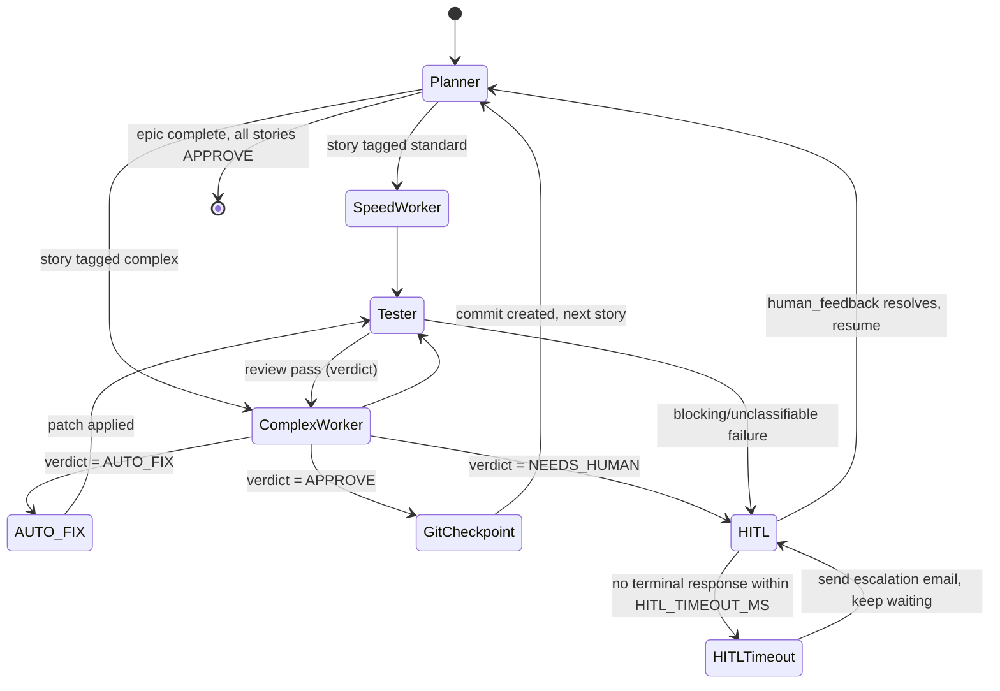

# Graph Topology & State Machines

Companion to [SPEC.md](SPEC.md). Diagrams and node-transition detail live here per Spec Law (diagrams never belong in the kernel).

## GraphState (fixed contract — see SPEC.md Constraints)

```
GraphState {
  spec: string                 // contents/path of spec.md
  tasks_queue: Epic[]          // epics -> stories, with per-story status
  current_code: string | null  // most recent diff/patch under review
  terminal_output: string | null
  error_status: "ok" | "auto_fixed" | "needs_human" | null
  human_feedback: string | null
}
```

## Node topology



Note: the `AUTO_FIX` transition is shared by both the autonomous dev-an-epic loop and manual review (see Entry points below) — manual review re-enters this same loop at the Reviewer step rather than running a separate patch mechanism.

## Reviewer verdict rubric (Complex Worker/Reviewer node)

Fixed three-value verdict — no free-form outcomes (SPEC.md Constraints):

- **APPROVE** — implementation matches spec.md intent, no architectural deviation, tests pass.
- **AUTO_FIX** — a fixable issue exists (lint, minor type error, small alignment gap) that a worker node can resolve without human judgment; routes back through Tester after the fix.
- **NEEDS_HUMAN** — triggers HITL when any of:
  - the implementation deviates from spec.md's architecture/constraints in a way that changes a design decision,
  - the story or its acceptance criteria are ambiguous or internally conflicting,
  - the change touches a security-sensitive surface (auth, secrets, data access boundaries),
  - AUTO_FIX attempts on the same story have reached `MAX_AUTO_FIX_ATTEMPTS` (default 1) without a passing Tester run — forces NEEDS_HUMAN regardless of what the failure itself looks like.

## HITL escalation sequence

1. Graph reaches a HITL node (NEEDS_HUMAN verdict or blocking Tester failure) and prints a **short, one-line summary** via `readline` — the verdict plus which rubric trigger fired (e.g. "NEEDS_HUMAN: security-sensitive change in auth middleware") — not a full context dump.
2. The user can type an expand command (e.g. `show diff` / `show output`) to print the full diff, reviewer reasoning, or Tester output on demand before answering, or respond directly with free-form feedback.
3. A `setTimeout` for `HITL_TIMEOUT_MS` (default 300000ms) starts in parallel with the terminal `readline` wait.
4. If the terminal responds first: timeout is cleared, `human_feedback` is populated, graph resumes at Planner.
5. If the timeout fires first: exactly one notification email is sent via a transactional email API (HTTP POST + API key — not raw SMTP) to `HITL_NOTIFY_EMAIL`, describing the pending decision; the terminal prompt remains open and still accepts input afterward (no re-timeout in v1 — single escalation, not a repeating alarm).

## Entry points

- **`dev an epic <name>`** — Planner locates the named epic in tasks_queue (creating story breakdown first if not already decomposed), then drives Speed/Complex Worker → Tester → Reviewer → (APPROVE → GitCheckpoint → next story | AUTO_FIX loop | HITL pause) across every story in the epic until the epic is complete or halted at HITL.
- **manual epic/story review** — user points the Reviewer node at an already-implemented epic/story set. For each story: an APPROVE verdict just records the verdict (GitCheckpoint only fires if that story didn't already have one); an AUTO_FIX verdict has the corresponding worker node apply the recommended patch and re-run Tester (same loop as the main dev path, entered directly at review rather than after a fresh implementation); a NEEDS_HUMAN verdict still triggers HITL. No separate `dev an epic` invocation is needed to apply the resulting patches.

## Git checkpoint policy

- One commit per completed story, created immediately after that story's Reviewer verdict is APPROVE (GitCheckpoint state) — not after every node/state transition, so intermediate AUTO_FIX iterations don't pollute history.
- Commit message references the story/epic ID so history stays traceable back to tasks_queue.
- The orchestrator only ever runs local `git commit` — it must never `git push`, force-push, or touch remotes automatically (SPEC.md Constraints).
- Manual-review patches (see Entry points) get their own checkpoint commit the same way, whether or not the story already had one from an earlier dev-an-epic run.
