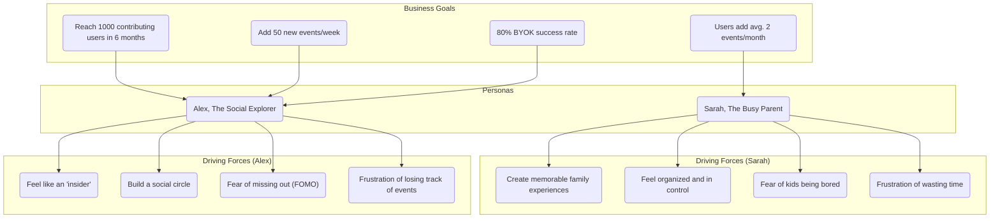

# Trigger Map: FestGrid

This document maps our business goals to user motivations, providing a strategic reference for design and development.

## Trigger Map Diagram

## Summary of Strategic Connections

-   **Sarah, The Busy Parent** is our primary target group. Her engagement (adding events to her calendar) is a key driver for making the platform a valuable, long-term resource. By addressing her fears of her kids being bored and the frustration of planning, we will drive adoption and retention in this large user segment.

-   **Alex, The Social Explorer** is our key secondary target group. His desire to be an 'insider' and his frustration with losing track of events make him the ideal `contributing_user`. He will be instrumental in seeding the platform with content (achieving the "Comprehensive Event Coverage" goal) and driving the success of the BYOK model.

## Design Focus Statement

> Our primary design focus is to **empower 'Sarah, The Busy Parent' to effortlessly create memorable family experiences.** We will achieve this by addressing her most intense drivers: **reducing the frustration of planning** and **alleviating her fear of her children being bored or unhappy.** By providing a seamless and reliable event discovery and management tool, we will drive user acquisition and engagement.